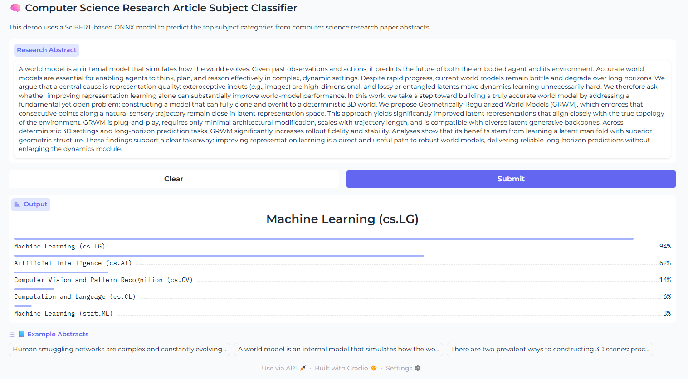
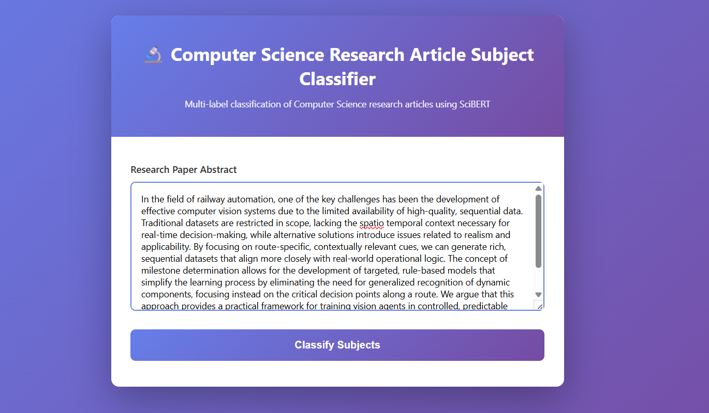
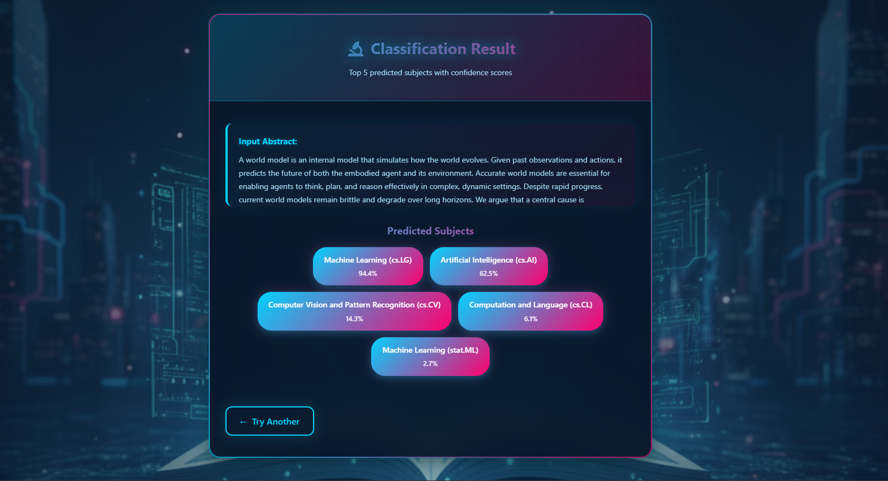

# Computer Science Research Article Subject Classifier

A **multi-label classification project** that predicts Computer Science subjects (e.g., _Machine Learning (cs.LG)_, _Artificial Intelligence (cs.AI)_) based on paper abstracts.

The pipeline includes:
- Scraping **~30,000 papers (2023–2025)** using Selenium  
- Training **SciBERT**, **DistilBERT**, and **DeBERTa-v3-small**
- Selecting **SciBERT** for deployment due to superior performance
- Converting the model to **ONNX** for optimized inference
- Deploying via **Flask on Render** with **Docker & GitHub Actions CI/CD** and **Gradio on Hugging Face Spaces**

---

---

## Table of Contents

- [Project Overview](#project-overview)
- [Branches](#branches)
- [Dataset](#dataset)
- [Model Training](#model-training)
- [Model Performance](#model-performance)
- [ONNX Conversion](#onnx-conversion)
- [Flask Web App](#flask-web-app)
- [Deployment](#deployment)
  - [Hugging Face Spaces](#deployment-on-hugging-face-spaces)
  - [Render with Docker & CI/CD](#deployment-on-render-with-docker--cicd)
- [Installation](#installation)
- [Usage](#usage)
- [Directory Structure](#directory-structure)
- [Technologies Used](#technologies-used)
- [Contributing](#contributing)
- [License](#license)
- [Links](#-links)

---

---

## Project Overview

This project classifies arXiv papers into multiple Computer Science subjects using their **abstracts**.

### Key Steps

1. **Data Collection** — Scraped ~30,000 papers using Selenium  
2. **Preprocessing** — Cleaned abstracts and subjects, filtered rare subjects  
3. **Model Training** — Trained SciBERT, DistilBERT, DeBERTa-v3-small  
4. **Model Selection** — Chose SciBERT for best performance  
5. **ONNX Conversion** — Exported model for optimized inference (reduced size from 421 MB to 110 MB)  
6. **Deployment** — Hosted on Render (with Docker & GitHub Actions) and Hugging Face Spaces

---

## Branches

| Branch | Description |
|:--|:--|
| **main** | Data scraping, preprocessing, model training, ONNX conversion and Deploying on Gradio on Hugging Face Spaces |
| **flask** | Flask web app with Docker containerization and CI/CD pipeline for Render deployment |

---

## Dataset

- **Source:** [arXiv.org](https://arxiv.org)  
- **Category:** Computer Science (cs)  
- **Years:** 2023–2025 (~10,000 papers/year, total ~30,000)  

**Fields:** `title`, `abstract`, `subjects`, `url`, `authors`

**Preprocessing:**
- Removed LaTeX, URLs, punctuation; converted to lowercase  
- Parsed subjects into full names (e.g., *Computation and Language (cs.CL)*)  
- Filtered rare subjects:
  - **Initial subjects:** 141
  - **Rare subjects removed:** 103
  - **Final subjects:** 38 (threshold = 0.005)
- Saved subject encodings to `subject_types_encoded.json`

---

## Model Training

Trained three models using **FastAI** + **blurr**:

| Model | Parameters | Source |
|:--|:--:|:--|
| **SciBERT** | ~110M | `allenai/scibert_scivocab_uncased` |
| **DistilBERT** | ~66M | `distilbert-base-uncased` |
| **DeBERTa-v3-small** | ~44M | `microsoft/deberta-v3-small` |

### Training Configuration

- **Max length:** 512 tokens  
- **Loss:** `BCEWithLogitsLossFlat`
- **Metrics:** Accuracy (thresh=0.2), F1 (micro/macro)
- **Training Stages:**
  - **Stage 0:** Train classifier head (frozen) — 2 epochs  
  - **Stage 1:** Fine-tune entire model — 3–5 epochs  

---

## Model Performance

| Model | Parameters | Valid Loss | Accuracy | F1 Score (Micro) | Training Time/Epoch |
|:--|:--:|:--:|:--:|:--:|:--:|
| **SciBERT** ✅ | ~110M | **0.0672** | **0.9743** | **0.5513** | ~4m 22s |
| **DistilBERT** | ~66M | 0.0761 | 0.9708 | 0.3881 | ~2m 23s |
| **DeBERTa-v3-small** | ~44M | 0.0764 | 0.9707 | 0.3867 | ~2m 23s |

### Why SciBERT?

**SciBERT** was selected for deployment based on:

1. **Domain-Specific Pretraining** — Trained on 1.14M scientific papers, providing better understanding of academic abstracts
2. **Superior F1 Score** — 0.5513 vs 0.3881 (DistilBERT) and 0.3867 (DeBERTa), representing **42-43% improvement**
3. **Lowest Validation Loss** — 0.0672 indicates better generalization
4. **Specialized Vocabulary** — Scientific terms and notation for better technical concept representation

**Trade-off:** Longer training time (4m 22s vs ~2m 23s), justified by substantial performance gains for classifying 38 Computer Science subjects.

---

## ONNX Conversion

Converted SciBERT to ONNX for efficient inference with quantization.

### File Size Comparison

| Format | Size | Reduction |
|:--|:--:|:--:|
| **PyTorch Model** | 421.3 MB | - |
| **ONNX (FP32)** | 424.7 MB | - |
| **ONNX Quantized (INT8)** | 110.3 MB | **74%** |

### Benefits

- **Faster Inference** — Optimized runtime performance
- **Reduced Size** — INT8 quantization (424.7 MB → 110.3 MB)
- **Cross-Platform** — Deploy on various frameworks and devices
- **Production Ready** — Industry-standard format

---

## Flask Web App

Flask app (in `flask` branch) allows users to input an **abstract** and receive **predicted subjects**.

### Features
- Input: Abstract via HTML form  
- Output: Top 5 subjects with confidence scores  
- Caching: In-memory cache for repeated queries
- API: Gradio Client API for inference
- Concurrent processing with timeout handling

**Files:**
```
flask/
├── app.py                    # Flask application with caching
├── templates/
│   ├── home.html            # Landing page
│   ├── index.html           # Classifier form
│   ├── result.html          # Results display
│   └── about.html           # Project information
├── static/
│   ├── style.css            # Cyberpunk theme styling
│   └── bg-image.png         # Background image
├── Dockerfile               # Docker containerization
├── .dockerignore           # Docker ignore rules
├── requirements.txt        # Python dependencies
└── render.yaml            # Render deployment config
```

---

## Deployment

### Deployment on Hugging Face Spaces

Deploy a Gradio interface on Hugging Face Spaces for interactive demos.

**Steps:**

1. Create a new Space on [Hugging Face Spaces](https://huggingface.co/spaces)
2. Select **Gradio** as the SDK
3. Use files from `deployment/` folder:

```
deployment/
├── app.py                    # Gradio application
├── requirements.txt          # Dependencies
├── README.md                 # Space documentation
```

🔗 **Try it here:** 👉 [Live Demo](https://huggingface.co/spaces/yeager07/multi-label-cs-article-classification)



---

### Deployment on Render with Docker & CI/CD

Deploy the Flask app on Render using **Docker** with automated **GitHub Actions** CI/CD pipeline.

#### 🐳 Docker Setup

The application is containerized using Docker for consistent deployment across environments.

**Dockerfile Features:**
- Python 3.12 slim base image
- Optimized layer caching
- Gunicorn WSGI server
- Health checks
- Non-root user for security

```dockerfile
FROM python:3.12-slim

WORKDIR /app

COPY requirements.txt .
RUN pip install --no-cache-dir -r requirements.txt

COPY . .

EXPOSE 10000

CMD ["gunicorn", "-b", "0.0.0.0:10000", "--workers", "2", "--threads", "4", "--timeout", "120", "app:app"]
```

#### 🚀 CI/CD Pipeline

Automated deployment using **GitHub Actions** that triggers on every push to `flask` branch.

**Workflow Features:**
- Automatic Docker image building
- Push to Docker Hub registry
- Trigger Render deployment via webhook
- Build caching for faster deployments

**GitHub Actions Workflow** (`.github/workflows/deploy.yml`):

```yaml
name: Deploy to Render

on:
  push:
    branches:
      - flask
  workflow_dispatch:

jobs:
  deploy:
    runs-on: ubuntu-latest
    steps:
      - name: Checkout code
        uses: actions/checkout@v4

      - name: Set up Docker Buildx
        uses: docker/setup-buildx-action@v3

      - name: Log in to Docker Hub
        uses: docker/login-action@v3
        with:
          username: ${{ secrets.DOCKER_USERNAME }}
          password: ${{ secrets.DOCKER_PASSWORD }}

      - name: Build and push Docker image
        uses: docker/build-push-action@v5
        with:
          context: .
          push: true
          tags: ${{ secrets.DOCKER_USERNAME }}/cs-article-classifier:latest

      - name: Trigger Render deployment
        run: curl -X POST ${{ secrets.RENDER_DEPLOY_HOOK_URL }}
```

#### 📋 Setup Instructions

**1. GitHub Secrets Configuration**

Add these secrets to your GitHub repository (Settings → Secrets and variables → Actions):

| Secret | Description |
|--------|-------------|
| `DOCKER_USERNAME` | Your Docker Hub username |
| `DOCKER_PASSWORD` | Docker Hub access token |
| `RENDER_DEPLOY_HOOK_URL` | Render deploy webhook URL |

**2. Docker Hub Setup**

1. Create account at [hub.docker.com](https://hub.docker.com)
2. Create repository: `cs-article-classifier`
3. Generate access token (Account Settings → Security → New Access Token)

**3. Render Setup**

**Option A: Using Blueprint (Recommended)**
1. Go to [Render Dashboard](https://dashboard.render.com)
2. New → Blueprint
3. Connect GitHub repository
4. Render auto-detects `render.yaml`
5. Click "Apply"

**Option B: Manual Setup**
1. New → Web Service
2. Connect GitHub repository
3. Configure:
   - **Environment:** Docker
   - **Branch:** flask
   - **Dockerfile Path:** ./Dockerfile
   - **Instance Type:** Free
4. Add environment variables:
   - `PORT` = `10000`
   - `FLASK_ENV` = `production`

**4. Get Deploy Hook**
1. Service Settings → Deploy Hook
2. Generate and copy URL
3. Add to GitHub Secrets as `RENDER_DEPLOY_HOOK_URL`

#### 🔄 Deployment Process

**Automatic:**
```bash
# Make changes and push
git add .
git commit -m "Update application"
git push origin flask

# GitHub Actions automatically:
# 1. Builds Docker image
# 2. Pushes to Docker Hub
# 3. Triggers Render deployment
```

**Manual:**
1. Go to GitHub Actions tab
2. Select "Deploy to Render" workflow
3. Click "Run workflow"

#### 📊 Monitoring

- **GitHub Actions:** View build logs in Actions tab
- **Render Dashboard:** Monitor deployment status and logs
- **Health Check:** `https://your-app.onrender.com/`

#### 🐛 Troubleshooting

**Build fails:**
```bash
# Test locally
docker build -t cs-classifier .
docker run -p 10000:10000 cs-classifier
```

**Deployment issues:**
- Check Render logs
- Verify environment variables
- Confirm port configuration (10000)
- Check Docker Hub image exists

🔗 **Live App:** 👉 [multi-label-cs-article-classifier.onrender.com](https://multi-label-computer-science-article.onrender.com/)




---

## Installation

### Prerequisites
- Python ≥ 3.8    
- Git  
- Docker (for containerized deployment)
- Hugging Face account

### Steps

```bash
# Clone repository
git clone https://github.com/yeager07/Multi-Label-CS-Article-Classification.git
cd Multi-Label-CS-Article-Classification

# Install dependencies
pip install -r requirements.txt
```

**requirements.txt**
```
flask
werkzeug==2.3.0
gradio_client
gunicorn==20.1.0
```

---

## Usage

### Data Collection & Training (main branch)

```bash
# Train and export model using Jupyter notebooks
jupyter notebook
```

### Flask App (flask branch)

**Local Development:**
```bash
git checkout flask
python app.py
# Visit http://localhost:5000
```

**Docker:**
```bash
docker build -t cs-classifier .
docker run -p 10000:10000 cs-classifier
# Visit http://localhost:10000
```

---

## Directory Structure

```
Multi-Label-Computer-Science-Article-Classifier/
├── main (branch)
│   ├── data/                     # Dataset files
│   ├── deployment/               # Hugging Face Spaces deployment
│   │   ├── app.py
│   │   ├── requirements.txt
│   │   └── README.md
│   ├── models/                   # Trained models
│   ├── notebooks/                # Training notebooks
│   ├── src/                      # Source code
│   │   ├── scraper.py
│   │   └── merge_data.py
│   ├── README.md
│   └── requirements.txt
│
└── flask (branch)
    ├── .github/
    │   └── workflows/
    │       └── deploy.yml        # GitHub Actions CI/CD
    ├── static/                   # CSS and assets
    │   ├── style.css
    │   └── bg-image.png
    ├── templates/                # HTML templates
    │   ├── home.html
    │   ├── index.html
    │   ├── result.html
    │   └── about.html
    ├── .dockerignore            # Docker ignore rules
    ├── .gitignore
    ├── Dockerfile               # Docker configuration
    ├── app.py                   # Flask application
    ├── render.yaml              # Render blueprint
    ├── README.md
    └── requirements.txt
```

---

## Technologies Used

### Machine Learning
- **SciBERT** (allenai/scibert_scivocab_uncased)
- **FastAI** 2.7.17 + blurr
- **PyTorch**
- **Transformers** library
- **ONNX Runtime** (optimization)

### Web Framework
- **Flask** (Backend API)
- **Gradio** (Interactive demo)
- **HTML/CSS** (Frontend)
- **Gunicorn** (WSGI server)

### DevOps & Deployment
- **Docker** (Containerization)
- **GitHub Actions** (CI/CD pipeline)
- **Render** (Flask hosting)
- **Hugging Face Spaces** (Gradio hosting)

### Data Processing
- **Pandas** (Data manipulation)
- **Selenium** (Web scraping)
- **JSON** (Data serialization)

---

## Contributing

Contributions are welcome!

1. Fork the repository
2. Create a feature branch: `git checkout -b feature-branch`
3. Commit changes: `git commit -m "Add new feature"`
4. Push and create PR: `git push origin feature-branch`

---

## 📄 License

This project is licensed under the MIT License.

---

## 🔗 Links

- **Live Flask App:** [multi-label-cs-article-classifier.onrender.com](https://multi-label-computer-science-article.onrender.com/)
- **Gradio Demo:** [HuggingFace Spaces](https://huggingface.co/spaces/yeager07/multi-label-cs-article-classification)
- **GitHub Repository:** [Multi-Label-CS-Article-Classification](https://github.com/yeager07/Multi-Label-CS-Article-Classification)

---

🌟 **If you like this project, give it a star on GitHub!**
